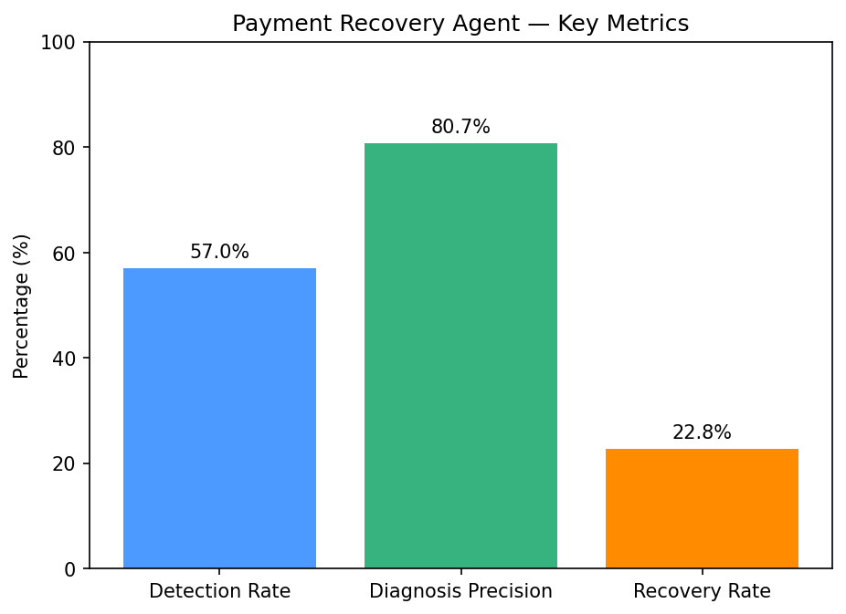

# Payment-Recovery-Agent
### Razorpay AI Buildathon — Track 03: AI Revenue Recovery

An agentic pipeline that detects revenue at risk, diagnoses the root cause of payment
failures, and executes a bounded recovery workflow — with a full audit trail and
measured outcomes.

---

## The Problem

Revenue loss rarely happens in one clean step. A payment degrades, a checkout gets
abandoned, or a subscription charge fails — and unless something intervenes, that
revenue is simply gone. This project builds an agent that closes the loop: **detect
the failure → diagnose why it happened → take the right recovery action → prove it
with numbers.**

## Architecture

```
Synthetic Transaction Data
          │
          ▼
   Detector Node          →  flags every non-success transaction
          │
          ▼
   Diagnoser Node         →  classifies root cause as temporary or permanent
          │
          ▼
   Recovery Node          →  auto-retries temporary failures, notifies customers
          │                  for permanent ones
          ▼
Audit Trail & Metrics     →  logs every decision, computes precision & recovery rate
```

Each node is a pure function that takes the shared pipeline state, updates it, and
passes it downstream — implemented as a `StateGraph` in **LangGraph**.

| Node | Responsibility |
|---|---|
| **Detector** | Scans all transactions, flags anything that isn't `success` |
| **Diagnoser** | Classifies each flagged transaction's failure reason as `temporary` (e.g. bank timeout, gateway error — retry-fixable) or `permanent` (e.g. card declined — needs customer action) |
| **Recovery** | Auto-retries `temporary` failures (simulated), sends a notification for `permanent` ones, and records the outcome |
| **Audit & Metrics** | Aggregates every decision into a traceable log and computes detection rate, diagnosis precision, and recovery rate |

## Results (on 100 synthetic transactions)

| Metric | Value |
|---|---|
| Detection rate | 57% (57 of 100 transactions flagged) |
| Diagnosis precision | 84.2% |
| Recovery rate | 21.1% of flagged transactions recovered |
| Audit log entries | 171 (one per transaction, per pipeline stage) |



## Why the numbers look like this

- **Diagnosis precision is intentionally not 100%.** The diagnoser simulates a
  real-world imperfect classifier (~12% controlled misclassification rate) rather
  than trivially matching the rule used to generate the ground truth.
- **Recovery is simulated, not live.** There's no real bank retry API in scope for
  this build, so a temporary-failure retry is modeled as a 60% chance of success —
  documented here rather than hidden.
- **Every decision is logged.** The audit trail (`audit_trail.csv`) records what the
  detector flagged, what the diagnoser predicted and why, and what action the
  recovery node took for every single transaction — nothing is a black box.

## Project Structure

```
├── Razorpay_Buildathon.ipynb   # full pipeline: data gen → nodes → graph → metrics
├── Payment_Transactions.csv    # synthetic dataset (100 transactions)
├── audit_trail.csv             # full decision log (171 entries)
├── metrics_chart.png           # detection / precision / recovery visualization
└── README.md
```

## How to Run

1. Open `Razorpay_Buildathon.ipynb` in Google Colab or Jupyter.
2. Run all cells top to bottom (`Runtime → Run all` in Colab).
3. The pipeline regenerates the synthetic dataset, runs all four nodes, and prints
   metrics at the end.
4. `audit_trail.csv` and `metrics_chart.png` are written to the working directory.

**Dependencies:** `pandas`, `langgraph`, `matplotlib` (installed via the first cell).

## Tech Stack

- **LangGraph** — StateGraph orchestration across the four pipeline nodes
- **Pandas** — synthetic dataset generation and audit trail export
- **Matplotlib** — metrics visualization

## Limitations & Honest Scope

This is a 100-transaction synthetic simulation built to demonstrate the
detect-diagnose-recover-measure pattern the track asks for, not a production
integration with Razorpay's live payment infrastructure. Given more time, the next
steps would be: a real conditional retry loop (bounded, max-attempts) instead of a
single simulated attempt, and replacing the rule-based diagnoser with a lightweight
learned classifier.
